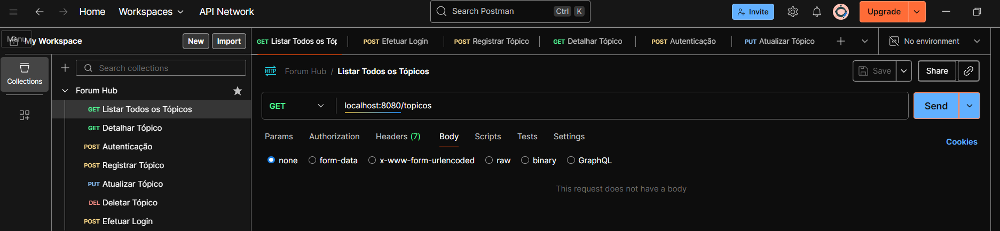

# Forum Hub&emsp;
O Challenge Forum Hub, é um projeto final oferecido pela alura Challenge Back-End (Oracle Next Education).

- **objetivo**

> desenvolvido em beck end java, utilizando API Rest.

- **o que encontrar**

> autenticação utilizando token, login com usuário e senha cadastrado no banco de dados; validações utilizando as requisições GET, POST, PUT e DELETE, segurança com autenticação stateless via Tokens JWT e persistência de dados.

- **tecnologias**

> java, Spring Boot, Spring Security (JWT), Spring Data JPA, Flyway (Migrations), MySQL, Swagger/OpenAPI.

- **dependências utilizadas**

> Lombok - Spring Web - Spring Boot Dev Tools - Spring Data JPA - Flyway Migration - MySQL Driver - Validation - Spring Security.


## Compilando e Executando o Forum Hub
Certifique-se de ter o [intelliJ](https://www.jetbrains.com/idea/download/?section=windows) e o [postman](https://www.postman.com/downloads/):

1. Faça o download do código fonte:

```sh
https://github.com/maumauriciog/Challenge_Forum_Hub
```

2. Configure o acesso no arquivo application.properties, encontrado projeto:

```
spring.datasource.url=jdbc:mysql://localhost:3306/<nome do banco de dados>
spring.datasource.username=root
spring.datasource.password=<senha acesso ao mySql>

spring.jpa.show-sql=true
spring.jpa.properties.hibernate.format_sql=true

api.security.token.secret=${<nome variável de ambiente com senha>:<senha, caso não encontre na variável de ambiente>}
```

3. postman:

&emsp;&emsp;

```
configure o postman para realizar os testes de autenticação utilizando token,
usuário e senha cadastrado via json no banco de dados. 
```

> [!IMPORTANT]
> O programa funciona somente utilizando uma IDE, neste caso, o [intelliJ](https://www.jetbrains.com/idea/download/?section=windows) com a biblioteca [GSON](https://mvnrepository.com/search?q=GSON) instalada.


## Contribuindo
Esperamos que outras organizações possam se beneficiar do projeto. Agradecemos qualquer contribuição da comunidade.

## Contato
Temos os seguintes canais para contato:
- maumauriciog@hotmail.com
  - `no campo Assunto escreva: Ajuda` para assuntos de como utilizar o sistema; e
  - `no campo Assunto escreva: Quero Contribuir` para aqueles que desejam contribuir.
- [GitHub](https://github.com/maumauriciog)


## Licensa
```
The MIT License (MIT)

Copyright (c) 2025 Maurício Gomes das Chagas

Permission is hereby granted, free of charge, to any person obtaining a copy of
this software and associated documentation files (the "Software"), to deal in
the Software without restriction, including without limitation the rights to
use, copy, modify, merge, publish, distribute, sublicense, and/or sell copies of
the Software, and to permit persons to whom the Software is furnished to do so,
subject to the following conditions:

The above copyright notice and this permission notice shall be included in all
copies or substantial portions of the Software.

THE SOFTWARE IS PROVIDED "AS IS", WITHOUT WARRANTY OF ANY KIND, EXPRESS OR
IMPLIED, INCLUDING BUT NOT LIMITED TO THE WARRANTIES OF MERCHANTABILITY, FITNESS
FOR A PARTICULAR PURPOSE AND NONINFRINGEMENT. IN NO EVENT SHALL THE AUTHORS OR
COPYRIGHT HOLDERS BE LIABLE FOR ANY CLAIM, DAMAGES OR OTHER LIABILITY, WHETHER
IN AN ACTION OF CONTRACT, TORT OR OTHERWISE, ARISING FROM, OUT OF OR IN
CONNECTION WITH THE SOFTWARE OR THE USE OR OTHER DEALINGS IN THE SOFTWARE.
```

## Agradecimento Especial
ONE - programa de educação e empregabilidade

&emsp;&emsp;
